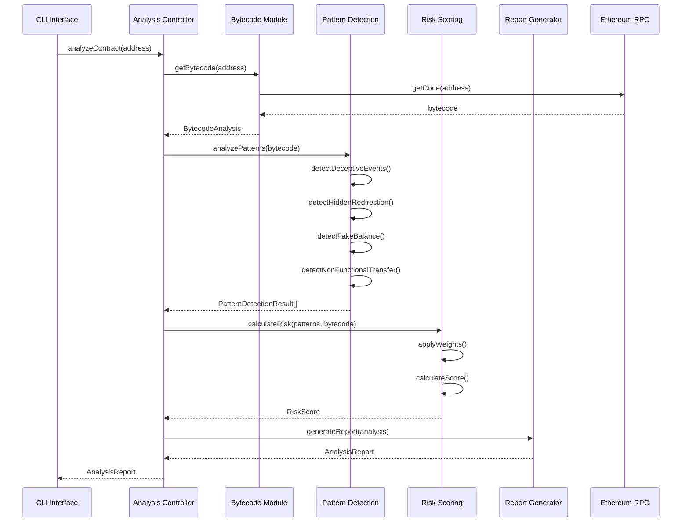

# ADR-001: Advanced Analysis Architecture

## Status
Accepted

## Context
The current smart contract analysis system requires a comprehensive architecture for advanced analysis capabilities. This includes bytecode analysis, pattern detection for scam identification, risk scoring, and comprehensive reporting. The system needs to scale to handle multiple scam categories with extensible pattern matching algorithms.

## Decision
We will implement a modular advanced analysis architecture with the following components:

### 1. Module Structure
```
src/analysis/
├── bytecode/
│   ├── index.ts
│   ├── decoder.ts
│   ├── analyzer.ts
│   └── opcodes.ts
├── patternDetection/
│   ├── index.ts
│   ├── deceptiveEvents.ts
│   ├── hiddenRedirection.ts
│   ├── fakeBalance.ts
│   └── nonFunctionalTransfer.ts
├── riskScoring/
│   ├── index.ts
│   ├── matrix.ts
│   └── calculator.ts
└── report/
    ├── index.ts
    ├── generator.ts
    └── formatter.ts
```

### 2. Core Technology Stack
- **Bytecode Retrieval**: `ethers.js` for blockchain interaction via public RPC
- **Validation**: Zod schemas for type safety and validation
- **Pattern Analysis**: Custom algorithms for each scam category
- **Risk Assessment**: Weighted scoring matrix with configurable parameters

### 3. Scam Categories
Based on existing research, we will implement detection for four primary categories:
1. **Deceptive Events**: Misleading event emissions
2. **Hidden Redirection**: Covert fund redirection mechanisms
3. **Fake Balance**: False balance display techniques
4. **Non-Functional Transfer**: Transfer functions that appear to work but don't

### 4. Architecture Components

#### 4.1 Bytecode Analysis Module
```typescript
// src/analysis/bytecode/index.ts
export interface BytecodeAnalysis {
  opcodes: OpCode[];
  functions: FunctionSignature[];
  events: EventSignature[];
  storage: StorageLayout;
  riskIndicators: RiskIndicator[];
}

export interface OpCode {
  instruction: string;
  position: number;
  gas: number;
  stack: number[];
}
```

#### 4.2 Pattern Detection Module
```typescript
// src/analysis/patternDetection/index.ts
export interface PatternDetectionResult {
  category: ScamCategory;
  confidence: number;
  indicators: PatternIndicator[];
  evidence: Evidence[];
  mitigationSuggestions: string[];
}

export interface PatternIndicator {
  type: string;
  severity: RiskLevel;
  description: string;
  location: CodeLocation;
}
```

#### 4.3 Risk Scoring Module
```typescript
// src/analysis/riskScoring/index.ts
export interface RiskScore {
  overall: number;
  breakdown: RiskBreakdown;
  factors: RiskFactor[];
  recommendations: string[];
}

export interface RiskMatrix {
  weights: PatternWeights;
  thresholds: RiskThresholds;
  modifiers: RiskModifier[];
}
```

#### 4.4 Report Generation Module
```typescript
// src/analysis/report/index.ts
export interface AnalysisReport {
  reportId: string;
  contractAddress: ContractAddress;
  timestamp: Date;
  bytecodeAnalysis: BytecodeAnalysis;
  patternResults: PatternDetectionResult[];
  riskScore: RiskScore;
  summary: ReportSummary;
  recommendations: string[];
}
```

### 5. Integration Architecture

#### 5.1 Sequence Diagram


### 6. Configuration and Extensibility

#### 6.1 Risk Scoring Matrix
```typescript
export const DEFAULT_RISK_MATRIX: RiskMatrix = {
  weights: {
    deceptiveEvents: 0.3,
    hiddenRedirection: 0.4,
    fakeBalance: 0.2,
    nonFunctionalTransfer: 0.1
  },
  thresholds: {
    low: 0.3,
    medium: 0.6,
    high: 0.8,
    critical: 0.9
  },
  modifiers: [
    { condition: 'hasProxyPattern', multiplier: 1.5 },
    { condition: 'hasTimelock', multiplier: 0.8 },
    { condition: 'isVerified', multiplier: 0.7 }
  ]
};
```

#### 6.2 Pattern Detection Algorithms
Each pattern detector implements a standardized interface:
```typescript
export interface PatternDetector {
  category: ScamCategory;
  analyze(bytecode: BytecodeAnalysis): PatternDetectionResult;
  getConfidence(indicators: PatternIndicator[]): number;
  generateEvidence(bytecode: BytecodeAnalysis): Evidence[];
}
```

### 7. CLI Integration Plan

#### 7.1 Command Structure
```bash
# Basic analysis
npm run analyze:contract 0x...

# Detailed analysis with specific patterns
npm run analyze:contract 0x... --patterns=deceptive-events,fake-balance

# Batch analysis
npm run analyze:batch contracts.json

# Generate report
npm run analyze:report 0x... --format=json,html,pdf
```

#### 7.2 Configuration Options
```typescript
export interface AnalysisConfig {
  rpcUrl: string;
  timeout: number;
  maxRetries: number;
  enabledPatterns: ScamCategory[];
  riskMatrix: RiskMatrix;
  outputFormat: OutputFormat[];
  verbosity: LogLevel;
}
```

## Security Considerations

### 1. Data Validation
- All inputs validated using Zod schemas
- Contract addresses validated against Ethereum address format
- Bytecode validated for proper hex encoding
- Pattern results validated before risk scoring

### 2. RPC Security
- Use only trusted public RPC endpoints
- Implement rate limiting and retry mechanisms
- Validate all responses from external services
- No private key handling or transaction signing

### 3. Analysis Safety
- Static analysis only - no contract execution
- Sandboxed pattern matching algorithms
- Input sanitization for all user-provided data
- Comprehensive error handling with secure defaults

### 4. Output Security
- Sensitive data redaction in reports
- Secure file handling for report generation
- Input validation for CLI parameters
- Protection against path traversal attacks

### 5. Environmental Security
```typescript
// Environment variable validation
export const AnalysisEnvSchema = z.object({
  ETHEREUM_RPC_URL: z.string().url(),
  ANALYSIS_TIMEOUT: z.coerce.number().positive(),
  MAX_RETRIES: z.coerce.number().min(1).max(10),
  LOG_LEVEL: z.enum(['error', 'warn', 'info', 'debug']),
  ENABLE_SECURITY_WARNINGS: z.boolean(),
  OUTPUT_DIR: z.string().min(1)
});
```

## Implementation Strategy

### Phase 1: Core Infrastructure (Week 1-2)
- Implement bytecode module with ethers.js integration
- Create base pattern detection framework
- Establish Zod validation schemas
- Set up testing infrastructure

### Phase 2: Pattern Detection (Week 3-4)
- Implement deceptive events detection
- Develop hidden redirection analysis
- Create fake balance detection algorithms
- Build non-functional transfer detection

### Phase 3: Risk Assessment (Week 5)
- Implement risk scoring matrix
- Create weight calculation system
- Add risk factor analysis
- Develop recommendation engine

### Phase 4: Reporting & CLI (Week 6)
- Build report generation system
- Create multiple output formats
- Implement CLI interface
- Add batch processing capabilities

## Testing Strategy

### Unit Tests
- Pattern detection algorithms
- Risk scoring calculations
- Bytecode analysis functions
- Validation schema compliance

### Integration Tests
- End-to-end analysis workflows
- RPC interaction testing
- Report generation validation
- CLI command verification

### Security Tests
- Input validation testing
- Error handling verification
- Performance under load
- Security vulnerability scanning

## Monitoring and Metrics

### Performance Metrics
- Analysis execution time
- Pattern detection accuracy
- Risk scoring consistency
- Report generation speed

### Quality Metrics
- False positive rates
- False negative rates
- Algorithm confidence levels
- User feedback integration

## Future Enhancements

### 1. Machine Learning Integration
- Pattern recognition improvement
- Automated weight adjustment
- Anomaly detection enhancement
- Historical analysis correlation

### 2. Extended Analysis
- Cross-chain analysis support
- DeFi protocol integration
- NFT scam detection
- Governance token analysis

### 3. Community Features
- Pattern sharing system
- Collaborative analysis tools
- Community-driven risk scoring
- Reputation system integration

## Alternative Approaches Considered

### 1. Symbolic Execution
**Rejected**: Too resource-intensive for production use
**Reasoning**: Static analysis provides sufficient accuracy with better performance

### 2. Machine Learning First
**Rejected**: Requires extensive training data not currently available
**Reasoning**: Rule-based system more transparent and maintainable

### 3. Third-Party Analysis Services
**Rejected**: Reduces control and increases dependency
**Reasoning**: In-house solution provides better customization and security

## Consequences

### Positive
- Comprehensive scam detection capabilities
- Extensible architecture for new patterns
- Strong type safety with Zod validation
- Scalable CLI integration
- Robust security considerations

### Negative
- Increased complexity in codebase
- Higher computational requirements
- Dependency on external RPC services
- Maintenance overhead for pattern updates

### Neutral
- Need for regular pattern database updates
- Requirement for performance monitoring
- Integration complexity with existing systems

## Decision Record

**Date**: 2025-01-07
**Status**: Accepted
**Reviewed By**: Development Team
**Next Review**: 2025-04-07

This ADR establishes the foundation for advanced smart contract analysis capabilities, providing a secure, extensible, and maintainable architecture for detecting various types of scam contracts.
